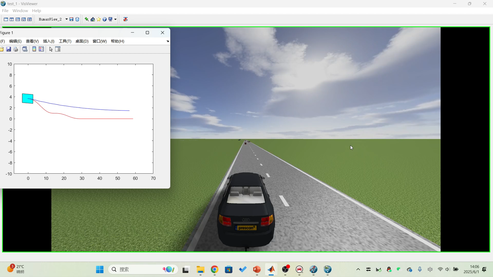
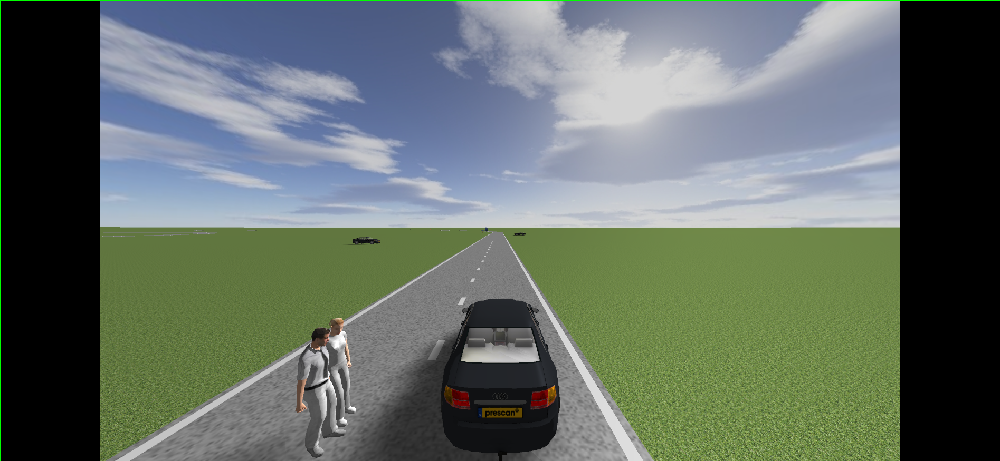
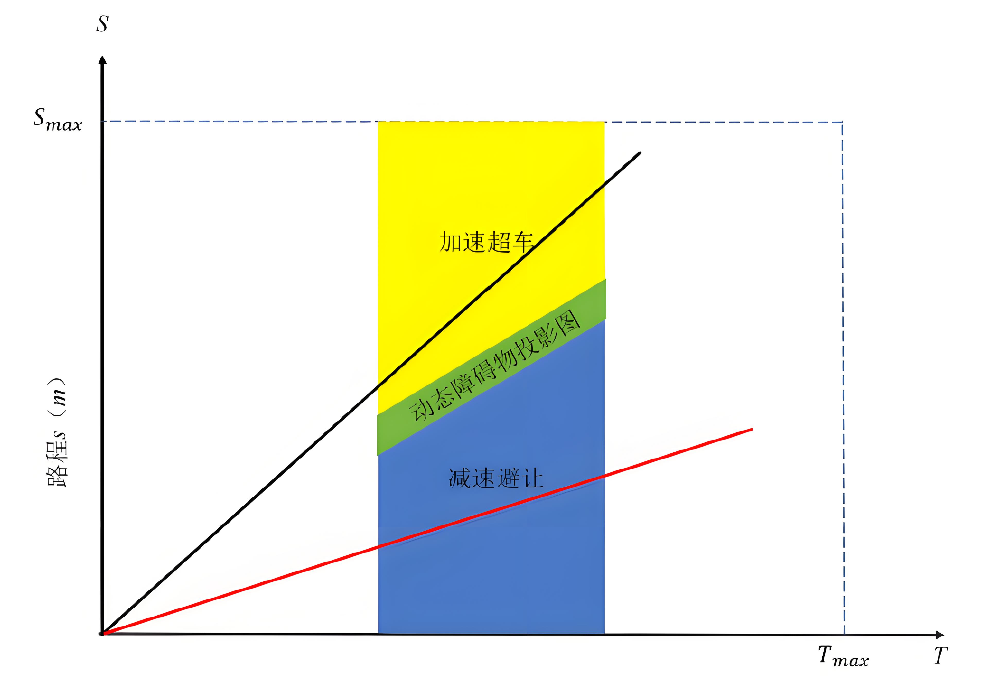
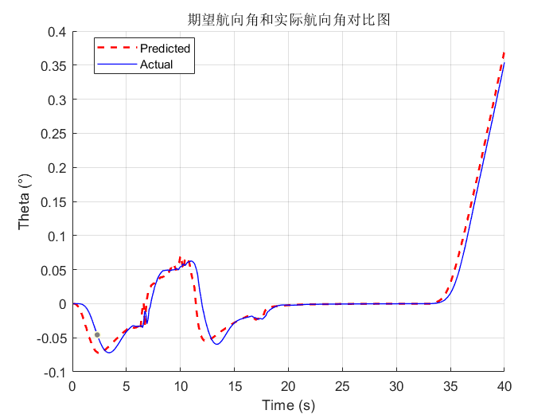
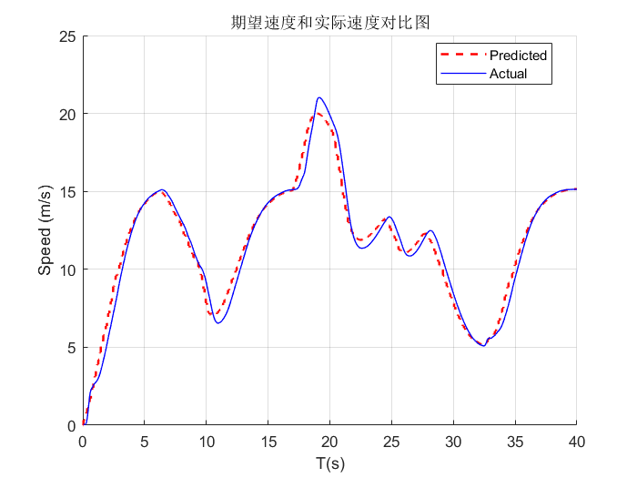
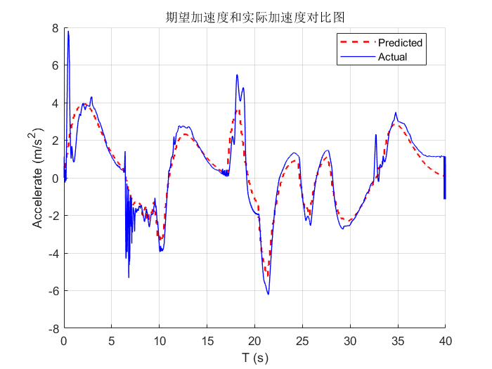

# 基于时空解耦的无人驾驶轨迹规划算法设计

本项目对应吉林大学本科毕业设计《基于时空解耦的无人驾驶轨迹规划算法设计》，主要围绕无人驾驶车辆在复杂道路环境下的轨迹规划与轨迹跟踪控制展开，采用时空解耦思想，将轨迹规划拆分为路径规划和速度规划两个子问题，并在 MATLAB/Simulink、Prescan、CarSim 联合仿真平台中完成验证。

## 项目简介

无人驾驶轨迹规划需要同时兼顾安全性、实时性、平滑性与跟踪精度。为降低三维时空规划问题的复杂度，本项目在 Frenet 坐标系下构建时空解耦模型，将规划问题拆分为：

- `S-L` 图上的横向路径规划，用于静态障碍物避让
- `S-T` 图上的纵向速度规划，用于动态障碍物避让

在此基础上，项目进一步结合：

- 基于动态规划（DP）的粗规划搜索
- 基于二次规划（QP）的路径/速度优化
- 基于 LQR 的横向轨迹跟踪控制
- 基于双 PID 的纵向速度与位置控制

最终在车道保持、静态障碍避让、动态障碍避让等场景下完成联合仿真验证。

## 研究内容

- 构建 Frenet 坐标系下的时空解耦轨迹规划模型
- 设计 `S-L` 图静态障碍物路径规划算法
- 设计 `S-T` 图动态障碍物速度规划算法
- 建立车辆动力学模型并设计横向 LQR 控制器
- 设计纵向双 PID 控制器，实现速度与位置跟踪
- 搭建 Prescan、Simulink、CarSim 联合仿真平台并完成实验验证

## 算法流程

1. 载入全局参考路径与车辆参数
2. 在 Frenet 坐标系中进行路径-速度解耦
3. 使用动态规划生成路径/速度粗解
4. 使用二次规划进行平滑与约束优化
5. 将规划结果送入横向 LQR 与纵向双 PID 控制器
6. 在 Prescan + Simulink + CarSim 环境中完成联合仿真

## 仿真平台与依赖

本项目为仿真工程，运行依赖的核心环境包括：

- MATLAB
- Simulink
- Prescan
- CarSim

代码中已显式使用 `lqr`，因此通常还需要：

- Control System Toolbox

如果你后续对模型中的优化模块做进一步修改，可能还需要：

- Optimization Toolbox

说明：

- 仓库内包含 `CarSim 2019.0` 生成的结果文件痕迹
- Prescan 相关模型、插件和资源文件已随工程保留在 `final/` 目录中

## 快速开始

1. 打开 MATLAB，并进入 [final](./final) 目录
2. 运行初始化脚本 `emplanner_init.m`
3. 打开主模型 `test_1_cs.slx`
4. 检查 Prescan、CarSim 的本地环境配置是否正确
5. 运行 Simulink 仿真，查看轨迹规划与控制结果

推荐入口文件：

- 初始化脚本：`final/emplanner_init.m`
- 主仿真模型：`final/test_1_cs.slx`
- 控制结果查看脚本：`final/testctrl.m`

## 目录结构

```text
9论文程序/
├─ README.md
├─ assets/                         # README 展示图片
└─ final/
   ├─ emplanner_init.m            # 初始化脚本，加载路径、标定表和控制参数
   ├─ test_1_cs.slx               # 主 Simulink 联合仿真模型
   ├─ Trajectories/               # 轨迹数据
   ├─ data/                       # 轨迹、航向等分析数据
   ├─ Models/                     # Prescan 场景模型
   ├─ Resources/                  # Prescan 资源文件
   ├─ V2XPlugin/                  # V2X 插件配置
   ├─ PBCameraPlugin/             # 摄像头插件资源
   ├─ Results/                    # CarSim / 联合仿真结果
   ├─ Temp/                       # 临时文件
   └─ slprj/                      # Simulink 自动生成缓存
```

## 结果展示

### 1. 路径规划联合仿真结果



### 2. 动态障碍物场景示意



### 3. S-T 图速度规划示意



### 4. 横向控制跟踪结果



### 5. 纵向控制跟踪结果





## 项目特点

- 使用时空解耦思想降低无人驾驶轨迹规划复杂度
- 将静态障碍避让与动态障碍避让分别映射到 `S-L` 与 `S-T` 图中处理
- 结合 DP + QP，提高规划结果的可行性、平滑性和安全性
- 采用 LQR + 双 PID 结构，兼顾横向和纵向跟踪性能
- 基于 Prescan、Simulink、CarSim 进行联合仿真，具备较强工程化特征

## 注意事项

- 本项目是毕业设计仿真工程，直接运行前需要先完成本地 MATLAB、Prescan、CarSim 联动配置
- `slprj/`、`Temp/`、部分 `Results/` 文件通常属于自动生成或缓存文件，上传 GitHub 时可按需要精简
- 仓库中包含较多 `.mat`、`.slx`、场景资源和结果文件，如仓库过大，建议后续配合 `.gitignore` 或 Git LFS 管理

## 项目背景

本仓库主要用于展示本人本科毕业设计在无人驾驶轨迹规划方向上的研究与仿真成果，适合作为：

- 毕业设计代码归档
- 论文配套工程展示
- 自动驾驶轨迹规划课程/项目参考

## 关键词

无人驾驶、时空解耦、轨迹规划、Frenet 坐标系、动态规划、二次规划、LQR、PID、Prescan、Simulink、CarSim
